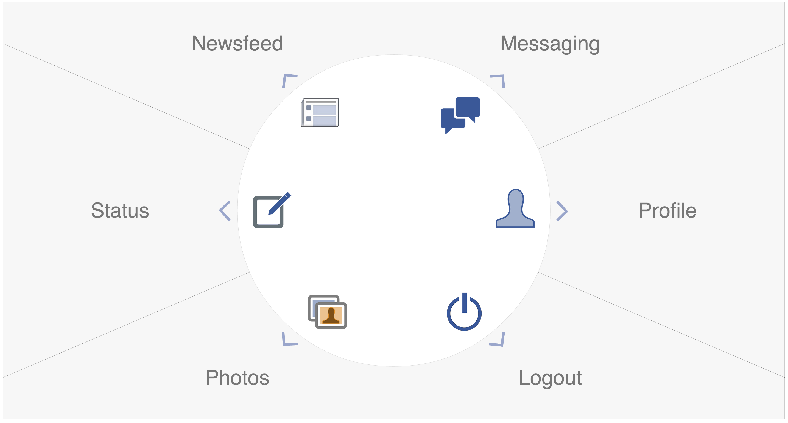

Accessible Facebook UI
====================

An accessible reimplementation of Facebook's core functions, designed to work with eye-tracking technology.

[Live Version](http://accessiblefacebookui.herokuapp.com "Accessible Facebook UI: Live Version")

## Contents
- Intro
- Global Features
	- Server
	- Dwell
- Pages	
	- Login
	- Homepage
	- Newsfeed
	- Messaging
	- Status
	- Profile
	- Photos
	- Logout
- Future Features
- Bugs
- Credits

## Intro
The Accessible Facebook UI project is a collaboration between students of CS132 at Brown University and the SpeakYourMind Foundation. It provides a simpler user interface for Facebook that can be controlled by eye-trackers, and uses dwell-click technology. The target users are clients with disabilities that force them to use eye-tracking software to navigate computer systems.

This README explains the Accessible Facebook UI app by feature. First, it explains all global features that apply to multiple sections. Then, it explains each page's functionality. Finally, it explains potential future features, bugs, and credits.

##Workflow

Clone the repository locally, and run <code>npm install</code> to initialize the node modules. Next run <code>node server.js</code> while within the root directory. Navigate to <code>http://localhost:8080/</code> in your browser to interact with the app.

## Global Features

### Server

- Index
	- index.html - Home page
	- First page that is loaded (will redirect to /login if first time)
- Login
	- login.html - Login page
	- Redirects here from any page if login.js says user not logged in
- Messaging
	- messaging.html
- Status
	- status.html
- Profile
	- profile.html
- Newsfeed
	- newsfeed.html
- Notifications
	- notifications.html
- Search
	- search.html

## Bugs
- IMPORTANT: Please test on modern computer and web browser. Be wary of department machines! Things that work great on our computer seem to, after handing it in on a Linux machine, be buggy (i.e. keyboard on some pages). Tested on Macbook Pro's with Chrome/Firefox
- IMPORTANT: If the user has no previous messages in /messaging, the screen appears to be blank even after it's loaded. Have someone send you a message on Facebook while you are on /messaging, and it should appear in realtime.
- Keyboard does NOT work in /messaging: we simply didn't have time when it came down to the wire, after we finally implemented Facebook Chat.
- If internet times out while loading Chat, Chat will never load. Can be fixed by refreshing.
- Blurry photos for Chat

### Facebook API
We use Facebook's Graph API v2.0. Login as well as all HTTP requests are controlled through Facebook's Javascript SDK.

### Dwell-Click
We implemented a dwell-click functionality by which a user may dwell over clickable elements such as buttons and links for 1000ms to click them. The app presents the user with a color-fading visual cue to indicate the process of dwelling and finishing clicking.

##Pages

### Login
- Users can login by dwelling upon the login button in /login. Since login must be controlled through Facebook's dialog boxes, a caretaker would be expected to login once for each user.
- Whenever a user navigates to a page without being logged in, they are redirected to the login page.

### Homepage
- /index is the homepage for the chat application.
- It is written using the Raphael.js library which allows for vector drawing.

### Newsfeed
- /newsfeed renders a user's newsfeed. Facebook's feed items are varied and complex (photos, videos, links etc.); our implementation only displays basic versions of these.
- Newsfeed also allows one to like posts and comment on them. It also shows the people who've liked each post.

### Messaging
- /messaging is an XMPP chat client that uses X-Facebook-Platform OAuth Authentication to login to Facebook. Instead of creating an XMPP client from scratch, which we would not have had time for, we used an open-source browser XMPP client called Converse.js. We integrated Converse.js with our application, and I modified the code of the file to authenticate using Facbeook, instead of having the user log in directly.

### Status
- /status is a simple way for the user to post a text-based status update. It makes use of a dwell-controlled on-screen QWERTY keyboard.

### Profile
- /profile renders the user's personal profile. It links to the person's About page, Photos page, and Status Update page.

### Photos
- /photos displays user's Profile Photos, Tagged Photos and Albums.
- User can navigate between photos within an album, like them, and comment on them.

## Future Features
- Messaging: Compose a new message
- Messaging: Instant messaging only so you only see the messages you only get in a certain session.
- Messaging: We want to use our own node.js server as a BOSH server; right now we still use Converse.JS's test BOSH servier bind.converse.org
- Search
- Friend Requests
- Newsfeed: Reading comments on newsfeed

## Credits
The Accessible Facebook UI project was a semeseter-long project by students of *CS132 - Making Modern Web Apps* at Brown University during Spring 2014 in collaboration with the SpeakYourMind Foundation. Members of the team were:

- Abigail Moses (abigail_moses@brown.edu)
	- Chat Frontend
	- Implemented dwell_gist to create easy to access dwell-click functionality
	- Collaborated on Design Interface
	- Newsfeed Frontend
	- Status Frontend
- Athyuttam Eleti (athyuttam_eleti@brown.edu)
	- Implemented Facebook API initialization
	- Implemented Login Workflow
	- Implemented Status Update
	- Implemented Newsfeed
- Elyse McManus (elyse_mcmanus@brown.edu)
	- Implemented Photos
	- Implemented Profile
	- Developed prototype to pause dwell-click functionality
- Matt Sanders (msanders@risd.edu)
	- Designed interface
	- Implemented Homepage
	- Created icons
	- Ongoing design of global features
- Michael Weinstein (michael_weinstein@brown.edu)
	- Facebook Chat
	- Adapting Converse.js
	- Building initial Server structure
	- Setting up Facebook Authentication
	- Tested modules (i.e. passport-facebook, node-xmpp, Strophe)
